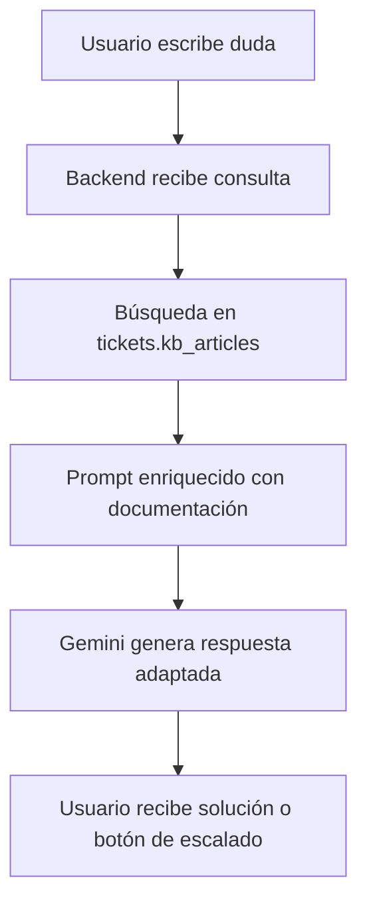

# Propuesta de Diseño: Chatbot de Soporte Inteligente (Evitación de Tickets)

Este documento detalla la arquitectura, el flujo de usuario, la API del backend y el diseño de la interfaz para la futura integración de un chatbot asistente virtual de soporte de TI. El objetivo principal de este sistema es ayudar a los usuarios a resolver sus incidencias de manera autónoma utilizando la documentación existente en la Base de Conocimiento (Knowledge Base), reduciendo la carga de soporte técnico.

---

## 1. Arquitectura de Información (RAG - Retrieval-Augmented Generation)

El chatbot operará bajo el patrón **RAG**, el cual funciona en cuatro pasos:



### Flujo Detallado:
1. El usuario introduce un mensaje en el widget de chat (ej: *"no puedo imprimir en la impresora central"*).
2. El backend intercepta el mensaje y realiza una búsqueda de texto en la tabla `tickets.kb_articles` filtrando por palabras clave (ej: *"imprimir"*, *"impresora"*, *"central"*).
3. El sistema selecciona los **3 artículos de base de conocimiento más relevantes**.
4. La información de estos artículos, junto con el historial de la conversación actual, se envía en una solicitud a la API de Gemini estructurada con un prompt del sistema restrictivo.
5. Gemini genera una respuesta amigable, paso a paso, utilizando **únicamente** la información de los artículos provistos.
6. Si la información no soluciona el problema, el bot ofrece un botón para **"Crear Ticket"**.

---

## 2. API del Backend (Propuesta)

### Endpoint: `POST /api/kb/chat`
* **Acceso**: Privado (Usuarios autenticados).
* **Entrada (Request Body)**:
  ```json
  {
    "message": "Mi ordenador no se conecta a la red corporativa",
    "history": [
      { "role": "user", "text": "Hola, tengo un problema." },
      { "role": "model", "text": "Hola, ¿en qué puedo ayudarte hoy?" }
    ]
  }
  ```

* **Lógica del Controlador (`chat.controller.js`)**:
  ```javascript
  const { poolPromise, sql } = require('../config/db');
  
  exports.handleChatSession = async (req, res, next) => {
    const { message, history } = req.body;
    
    try {
      const pool = await poolPromise;
      
      // 1. Extraer palabras clave básicas o realizar búsqueda Full-Text
      // En SQL Server se puede usar CONTAINS/FREETEXT o coincidencias LIKE consecutivas:
      const searchKeywords = message.split(' ').filter(w => w.length > 3).map(w => `%${w}%`);
      
      let queryText = `
        SELECT TOP 3 title, content 
        FROM tickets.kb_articles 
        WHERE is_published = 1
      `;
      
      if (searchKeywords.length > 0) {
        queryText += ' AND (' + searchKeywords.map((_, idx) => `title LIKE @kw${idx} OR content LIKE @kw${idx}`).join(' OR ') + ')';
      }
      
      const request = pool.request();
      searchKeywords.forEach((kw, idx) => {
        request.input(`kw${idx}`, sql.NVarChar, kw);
      });
      
      const dbResult = await request.query(queryText);
      const matchedArticles = dbResult.recordset;
      
      // 2. Construir contexto para Gemini
      const contextText = matchedArticles.map((art, idx) => `
        ARTÍCULO ${idx + 1}: ${art.title}
        ---
        ${art.content}
        ---
      `).join('\n');
      
      // 3. Preparar prompt del sistema para Gemini
      const systemPrompt = `
        Eres el Asistente Virtual de Soporte Técnico de Jata.
        Tu misión es guiar al usuario para resolver su incidencia utilizando exclusivamente la documentación adjunta.
        
        DOCUMENTACIÓN DISPONIBLE:
        ${contextText || 'No hay artículos de soporte relacionados con este tema.'}
        
        INSTRUCCIONES CLAVE:
        1. Responde de forma muy concisa, educada y en español.
        2. Si la documentación disponible soluciona la duda del usuario, explícale los pasos con claridad.
        3. Si la documentación NO soluciona su duda o no se relaciona, dile amablemente: "Lo siento, no he encontrado información exacta para solucionar tu incidencia en nuestra base de datos."
        4. Si no puedes solucionarlo, indícale que puede abrir un ticket de soporte utilizando el botón de escalado en la interfaz.
        5. Evita inventar contraseñas, IPs, servidores o enlaces que no figuren en la documentación.
      `;
      
      // 4. Llamar a la API de Gemini (usando fetch nativo)
      // Construir payload e incluir el historial de chat con el nuevo mensaje.
      // ... Lógica de conexión con la API de Gemini ...
      
      res.json({
        reply: "Respuesta de la IA...",
        articlesSuggested: matchedArticles.map(a => a.title),
        suggestEscalation: matchedArticles.length === 0 // Sugerir abrir ticket directamente si no hay artículos
      });
      
    } catch (error) {
      next(error);
    }
  };
  ```

---

## 3. Interfaz del Frontend (UI/UX)

Se sugieren dos posibles experiencias de usuario en el frontend:

### Opción A: Widget Flotante (Recomendado)
* **Visual**: Una burbuja de chat redonda con un icono moderno (ej: `MessageSquare`) posicionada abajo a la derecha de la pantalla en la sección del Dashboard del usuario.
* **Comportamiento**: Al hacer clic, se abre una pequeña ventana de chat estilo "Messenger". Mantiene el historial en el estado de React.

### Opción B: Paso Previo al Crear Ticket
* **Visual**: Integrado directamente en la vista `/dashboard/tickets/new`.
* **Comportamiento**: Antes de que aparezca el formulario completo para ingresar prioridad y adjuntos, se le pide al usuario escribir brevemente qué le ocurre.
* El asistente intenta solucionarlo. Si el usuario marca "No solucionado", se desbloquea el resto del formulario tradicional.

---

## 4. Flujo de Escalado Inteligente (Evitación de Doble Trabajo)

Si el usuario decide abrir un ticket porque el bot no resolvió su duda, el chat facilitará el proceso:

1. El chatbot consolida un resumen de la conversación:
   * **Incidencia**: *"Problema con el acceso al servidor JataERP"*
   * **Pasos intentados**: *"Intentó vaciar caché y cambiar de navegador, persiste el error 500"*
2. Al pulsar el botón **"Abrir Ticket"**, el chatbot redirige al usuario pasándole este resumen por estado de navegación o query params:
   `navigate('/dashboard/tickets/new', { state: { prefilledDescription: summary, prefilledTitle: title } })`
3. El formulario de creación de ticket cargará los campos autocompletados, de modo que el usuario solo tendrá que pulsar "Enviar", ahorrándole tiempo y dándole al equipo de soporte el historial de lo que ya se intentó.

---

## 5. Próximos Pasos para la Implementación

Cuando decidas abordar este desarrollo, la secuencia recomendada es:
1. **Crear ruta y controlador de Chat en el Backend** (`backend/src/routes/chat.js` y `backend/src/controllers/chat.controller.js`).
2. **Obtener una API Key de Gemini** y guardarla en la variable `GEMINI_API_KEY` del archivo `.env`.
3. **Desarrollar el componente visual de chat en React** en la carpeta `src/components/Chat/ChatbotWidget.tsx`.
4. **Agregar el componente de Chat al layout principal** (`src/pages/Dashboard.tsx`) para habilitarlo de manera global.
5. **Configurar el pre-rellenado de tickets** en `src/pages/TicketForm.tsx` leyendo los parámetros pasados desde el chat al escalar.
